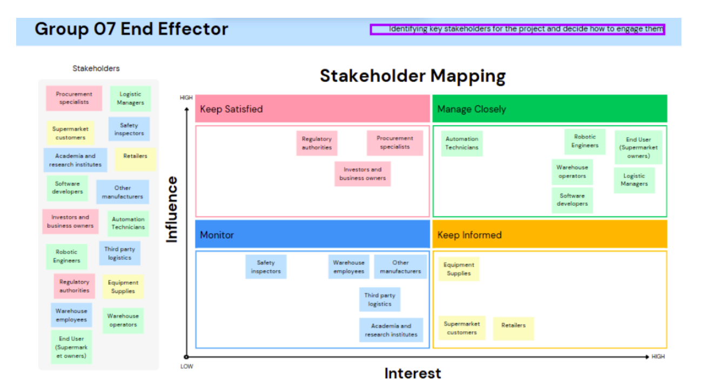
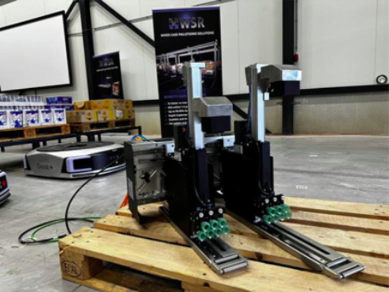
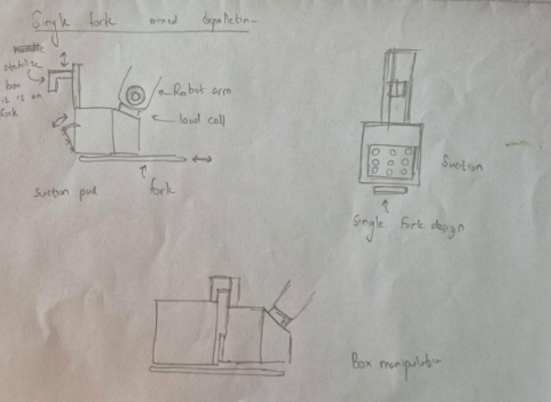

# Reconfigurable End Effector for Robotic Depalletizing

This repository documents the design and development of a flexible robotic end effector system, engineered to automate depalletizing operations in supermarket warehouses. The design emphasizes inclusive design principles, sensor-driven adaptability, and seamless mechanical-electronic integration.

---

## 📁 Table of Contents
1. [Project Overview](#project-overview)  
2. [Inclusive Design Framework](#inclusive-design-framework)  
3. [Market Research & Reference Design](#market-research--reference-design)  
4. [Conceptual Development](#conceptual-development)  
5. [Component Selection](#component-selection)  
6. [Mechanical Design](#mechanical-design)  
7. [Electronic Design](#electronic-design)  
8. [Firmware Development](#firmware-development)  
9. [Project Files](#project-files)  
10. [Team Members](#team-members)

---

## 🧠 Project Overview

This project aims to develop a **reconfigurable robotic end effector** capable of handling various box sizes and weights using vacuum-based gripping and pneumatic actuation. Key technologies include:

- **Time-of-Flight (ToF) sensors** for angular alignment  
- **Vacuum suction cups** for box lifting  
- **Pneumatic cylinders** for stabilization  
- **ATmega2560-based controller** with real-time firmware  

The end effector is compatible with standard robotic arms and designed for integration into warehouse logistics systems.

---

## 🌟 Inclusive Design Framework

We initiated this project using the [**Inclusive Design Toolkit**](https://www.inclusivedesigntoolkit.com/) by the University of Cambridge.

### 👥 Stakeholder Mapping

We categorized stakeholders into groups based on interest and influence to ensure inclusivity across the design lifecycle.

### 📌 User Needs Identified
- Automatic adaptation to box size and surface
- Safe handling of fragile or irregular packages
- Integration with existing robotic systems
- Minimal maintenance with reliable performance

---

## 🔍 Market Research & Reference Design

Before prototyping, we analyzed commercial solutions such as the **MCS-RP Gripper Series by WSR Solutions**, known for:
- Modular design
- High grip force
- Versatility in gripping geometry

---

## ✍️ Conceptual Development

We iterated through several hand-drawn and CAD-based sketches to derive the optimal design.

This included a **functional block diagram** illustrating the interaction between suction mechanisms, ToF sensors, solenoids, and microcontroller units.

---

## 🧹 Component Selection

We conducted technical evaluations and cost analysis to select the following:

| Component         | Model/Type              | Reason                          |
|------------------|--------------------------|---------------------------------|
| Stepper Motor     | 42HSE47 Closed-loop     | Precision & torque control      |
| Pneumatic Cylinders | Airtac TN10X50 / MAL16X100 | Compact & cost-effective       |
| Suction Cups      | Schmalz FSG 20 NBE-ESD  | Adaptability to uneven surfaces |
| Vacuum Ejector    | Airbest AZH10BS         | Cost-efficient vacuum generation|
| Microcontroller   | ATmega2560              | Multi-UART, reliable processing |

---

## 🛠️ Mechanical Design

### SolidWorks Iterations:
1. **First iteration**: Focused on confirming dimensions and fit.
2. **Final enclosure**: Zinc-coated sheet metal for durability and optimized integration with electronics.

---

## 🔌 Electronic Design

We designed a **hierarchical schematic** in Altium Designer and manufactured the PCBs via JLCPCB.

### 📀 PCB Highlights:
- 2-layer main control PCB  
- Separate buck converter PCB for power regulation  
- RS485, UART, and SPI interfaces  
- Solenoid switching circuitry with flyback protection

> ⚙️ PCB and schematic files are included in the `/hardware` directory.

---

## 💻 Firmware Development

The firmware was developed using **Atmel Studio** and **register-level programming** for ATmega2560. Key features include:

- Multi-UART communication with ToF sensors
- Real-time control of vacuum, solenoids, and motors
- Serial communication with host controller (RS485)
- Modular codebase with functional headers and drivers

> Firmware source can be found under the `/firmware` folder.

---

## 📂 Project Files

| Folder         | Description                                  |
|----------------|----------------------------------------------|
| `/firmware`    | Register-level code for ATmega2560           |
| `/hardware`    | Altium schematics, PCB, and BOM              |
| `/cad`         | SolidWorks files and STL exports             |
| `/images`      | Diagrams and renders used in this repository |
| `/docs`        | Full project report and datasheets           |

---

## 👨‍💻 Team Members

- Muftee M. M. M.  
- Goonetilleke P.  
- Jayakody J. A. K.  
- **Rajinthan R.** (GitHub Maintainer)  
- Warushavithana N. D.  
- Praveen V. V. J.  
- V. G. V. Gunasekara  

---

## 📜 License

This project is licensed under the MIT License – see the [LICENSE](LICENSE) file for details.
